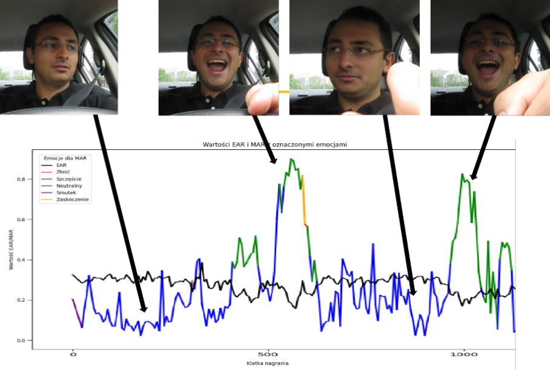

# Emotion Detection + EAR/MAR Analysis (CNN + dlib)

**EmotionDetection.ipynb** — trains a CNN (48×48 grayscale) on five emotions: *Angry, Happy, Neutral, Sad, Surprise*. Includes live confusion matrix callback and final evaluation.
**main.ipynb** — analyzes a video: computes **EAR** (Eye Aspect Ratio) and **MAR** (Mouth Aspect Ratio) with **dlib** 81 landmarks and overlays **emotion predictions** from the trained model on a chart.

## Features
- Keras/TensorFlow CNN for 5-class facial emotion recognition
- Data augmentation (rotation/shear/zoom/horizontal flip)
- Periodic confusion matrix during training
- dlib-based 81 facial landmarks
- Video analysis (line chart with MAR color-coded by predicted emotion + black EAR line)


## Dataset layout (expected)
```
data_selected/
├─ train/
│ ├─ Angry/ .jpg
│ ├─ Happy/ ...
│ ├─ Neutral/ ...
│ ├─ Sad/ ...
│ └─ Surprise/ ...
└─ test/
├─ Angry/ ...
├─ Happy/ ...
├─ Neutral/ ...
├─ Sad/ ...
└─ Surprise/ ...
```
Classes must match exactly: `Angry`, `Happy`, `Neutral`, `Sad`, `Surprise`.
As dataset for training the neural network download FER-2013 and for best results use 5 out of 7 emotions available, mentioned about. For tests download YAWDD dataset.
shape_predictor_81_face_landmarks.dat also needs to be downloaded.

## Results
<p align="center">
  <br>
  <em>Wykres przedstawiający EAR i MAR wraz z emocjami dominującymi dla nagrania 3-FemaleGlasses (baza YAWDD)</em>
</p>

<p align="center">
  <br>
  <em>Fragment wykresu dla nagrania 3-MaleGlasses (baza YAWDD) wraz z kadrami z tego nagrania</em>
</p>
